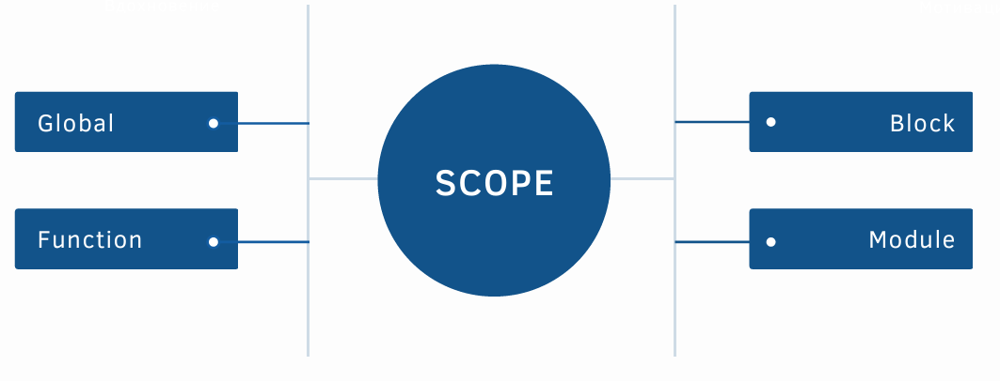
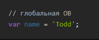
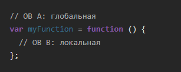
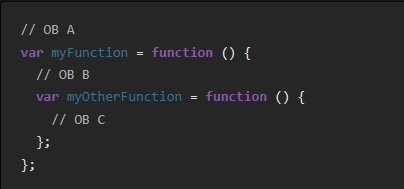
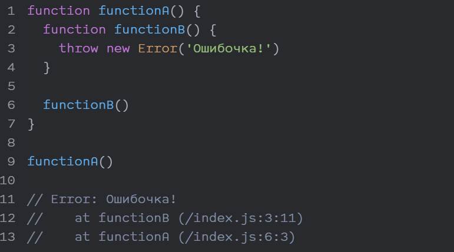
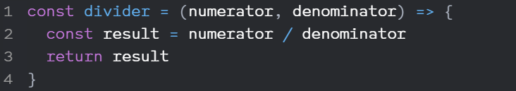
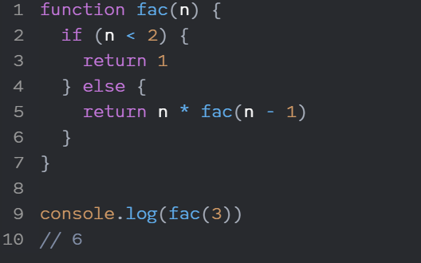
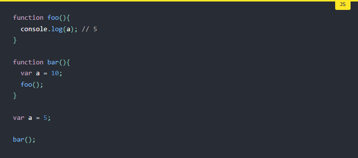
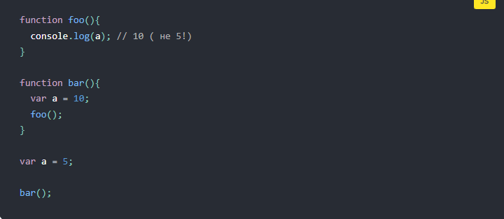

### У JS есть несколько концепций, связанных с областью видимости (scope), которые не всегда ясны начинающим разработчикам (и иногда даже опытным). Эта статья посвящена тем, кто стремится погрузиться в пучину областей видимости JS, услышав такие слова, как область видимости, замыкание, “this”, область имён, область видимости функции, глобальные переменные, лексическая область видимости, приватные и публичные области

## Что такое область видимости?
### В JS область видимости – это текущий контекст в коде. ОВ могут быть определены локально или глобально. Ключ к написанию пуленепробиваемого кода – понимание ОВ. Давайте разбираться, где переменные и функции доступны, как менять контекст в коде и писать более быстрый и поддерживаемый код (который и отлаживать быстрее). Разбираться с ОВ просто – задаём себе вопрос, в какой из ОВ мы сейчас находимся, в А или в Б?

### Глобальная ОВ – ваш лучший друг и худший кошмар. Обучаясь работе с разными ОВ, вы не встретите проблем с глобальной ОВ, разве что вы увидите пересечения имён. Часто можно услышать «глобальная ОВ – это плохо», но нечасто можно получить объяснение – почему. ГОВ – не плохо, вам нужно её использовать при создании модулей и API, которые будут доступны из разных ОВ, просто нужно использовать её на пользу и аккуратно.

## Функциональная ОВ.
### Все локальные ОВ создаются только в функциональных ОВ, они не создаются циклами типа for или while или директивами типа if или switch. Новая функция – новая область видимости. Пример:

### Так просто можно создать новую ОВ и локальные переменные, функции и объекты.
## Функция — это блок из различных команд. С ней легко создавать порядок в коде программы, избавляясь от ненужных повторений и запутанных частей.
### В JavaScript есть два типа функций по признаку имени. В примере ниже функция называется именованной, потому что у неё есть имя.Противоположность именованным функциям — анонимные. У таких имени нет:
### Они работают одинаково, но по-разному ведут себя в консоли и стеке вызовов. Допустим, мы написали программу, в которой есть ошибка. Если наши функции были именованными, то стек вызовов покажет, какая функция вызвала какую, и что привело к ошибке:

### Здесь видно, какие функции вызывали какие, и что привело к ошибке, вплоть до номера строки и символа. С анонимными сложнее, поскольку вместо имён функций будут лишь номера строк.
### Вызов глобальной переменной numberFour не приводит к ошибке, тогда как переменная numberFive по-прежнему существует только внутри функции.
### В многострочных стрелочных функциях кода больше, поэтому они имеют фигурные скобки, но в остальном не отличаются:

### А ещё у стрелочных функций нет контекста выполнения, но о нём чуть ниже.
### Внутри функции можно вызывать её саму — это пример рекурсивной функции.

### Если разложить пример, то получится следующая цепочка:
### fac(3) это 3 * fac(2);
### fac(2) это 2 * fac(1);
### fac(1) это 1.
### Получается, что fac(3) это 3 * 2 * 1, то есть 6. Такой подход часто применяется в математических операциях, но не ограничивается ими.
### У кода в момент выполнения есть «окружение». Это функция, которая сейчас отрабатывает, это содержащиеся в ней переменные, это глобальные переменные. Всё это и есть контекст.
# Динамическая область видимости
### Лексическая область видимости - это набор правил о том, как и где движок JavaScript может найти переменную. Ключевой характеристикой лексического контекста является то, что он определяется во время написания кода (при условии, что мы не используем eval () или with).
### Динамическая область видимости, по понятным причинам, подразумевает, что существует модель, в которой область видимости может определяться динамически во время выполнения, а не статически во время создания. Например:

### В лексической области видимости указывается, что ссылка на a в foo() будет преобразована в глобальную переменную a, что приведет к выводу значения 5.
### Динамическая область видимости, напротив, не связана с тем, как и где объявляются функции и области, а связана с тем, откуда они вызываются. Другими словами, цепочка областей видимости основана на стеке вызовов, а не на вложении областей видимости в коде.
### Таким образом, если бы JavaScript имел динамическую область видимости, то, когда выполняется foo(), теоретически приведенный ниже код, вместо 5 вернул бы 10 в качестве вывода.
